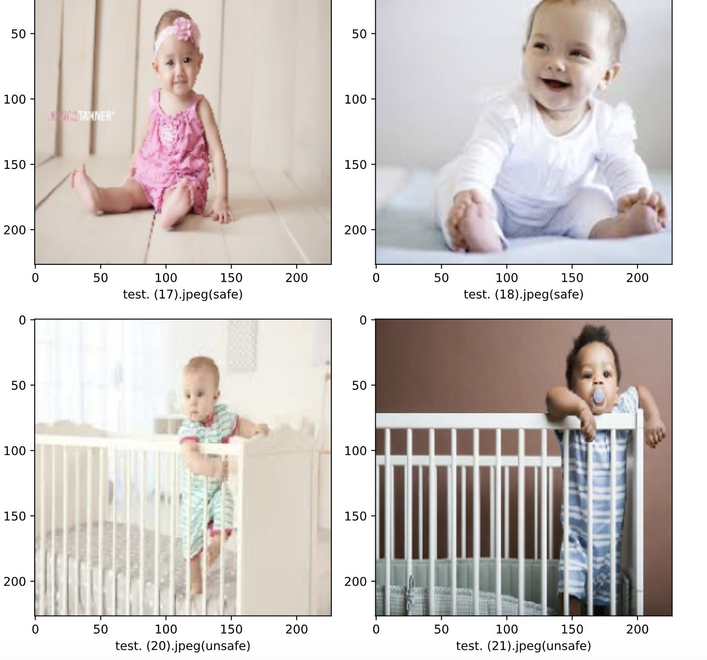
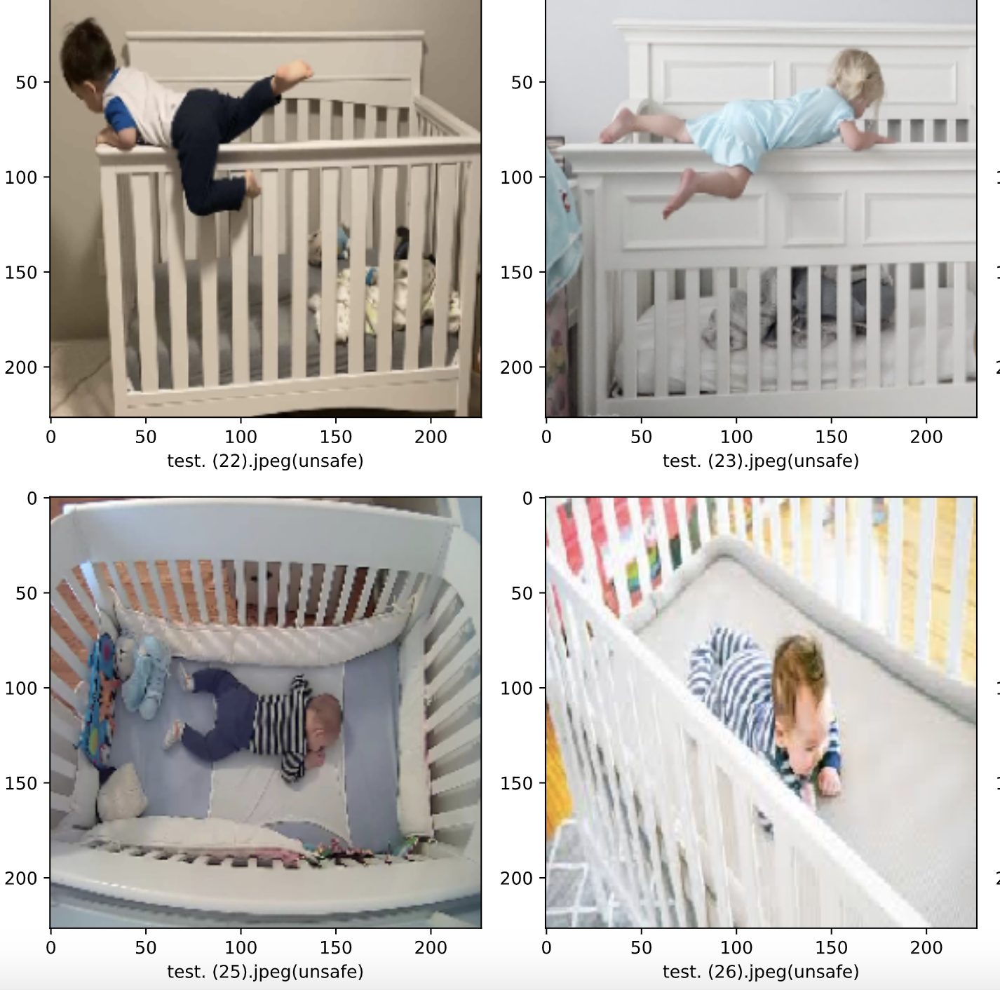

Authors: Dang Vi, Do Phuong, Tran Phuc

## Description

This is an Image Processing AI that would help to detect the baby subject and then 
recognize the action of that baby (sitting down/standing up/ lying down/etc.) 
and from that it will define if the baby is ‘safe’ or ‘unsafe’.

## Data set or other source materials

Our dataset contains 1600 images which are downloaded from Google and extracted from Youtube videos  
of completely different babies, in different cribs, camera settings and light settings.
Also, this number includes some baby doll images which were taken manually by our team member

## Methodology

We applied AlexNet architecture which is a famous model of convolutional neural network 
for images classification.
The project was built on Jupyter Notebook with the use of Keras library

## Some images of the result

# AI_BabySitter_Project
